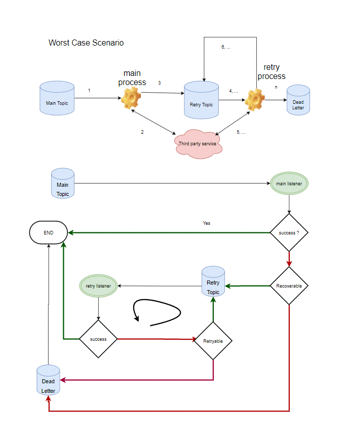

## What

It is non-blocking retry library based on Spring Kafka that try to replace the spring retry.

## Why

Spring Retry is mature and easy to use, however the problem it is blocking. By default, it would make the thread sleep
for 1 second and attempt again. This may cause a big problem for scalability.

One easy way is to use different kafka topic, and retry there. If retry keep failing, the message would be sent to dead
letter topic.

This library, implements single retry topic pattens



## How to use it

### 1. ConsumerWorker class

See sample project, need a class implement ConsumerWorker and specified as a spring bean.

### 2. Config the kafka

```yaml
nonblocking:
  kafka-consumers:
    - id: some-name                   # required
      consumer-worker-class: ca.bc.jx.kafka.server.SampleRetryableWorker # required
      topic-main: main1               # required
      topic-main-listener-number: 2   # default 1
      topic-retry: retry1             # required
      topic-retry-listener-number: 1  # default 1
      topic-dead-letter: dlq1         # optional, default omit gracefully
      fixed-interval: true            # default false, which is exponential, e.g. first 1s, second 2s, etc. 
      max-retries: 10                 # default 5
      retry-interval: 500             # default 1000ms
```

As you can see it is a list, and you can have multiple consumer listen to a list of different main topics.

### 3. Enable at configuration class

```
@EnableNonBlockingKafkaConsumers
```

That's all, the library will automatically listen to main and retry topic, and send message to retry and dead letter
topic.

It also handles the wait/sleep and schedule behind the scenes, with minimum code needed.